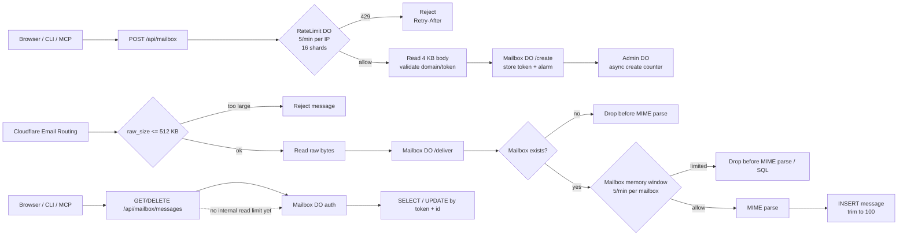

# Rate Limit Reference

Last reviewed: 2026-06-30.

This document explains the current limits and the reasoning for changing them.
It is a tuning reference, not a promise of exact accounting.

## Platform Budget

The Free tier is the design target for the first production validation.

Important Cloudflare limits:

```text
Workers requests          100,000/day
Workers CPU               10 ms/request
Workers memory            128 MB
Durable Object requests   100,000/day
Durable Object duration   13,000 GB-s/day
DO SQLite rows read       5,000,000/day
DO SQLite rows written    100,000/day
DO SQLite storage         5 GB/account, 1 GB/object on Free
Email Routing message     25 MiB inbound platform limit
```

This service intentionally sets a much lower email body limit than Cloudflare:

```text
incoming email raw size   512 KB
```

That keeps MIME parsing, memory use, and stored message size small. Attachments
are recorded as metadata only.

## Cost Paths

The expensive paths are not equal.

`POST /api/mailbox`:

```text
Worker request
RateLimit DO request
Mailbox DO request
Mailbox token storage write
Mailbox alarm write
Admin stats DO request on first creation
```

This is the public anonymous endpoint most likely to be abused. Rate limiting
must happen before reading the request body or creating the Mailbox object.

Incoming email:

```text
Email Worker invocation
raw_size check
raw byte read, bounded by 512 KB
Mailbox DO request
mailbox existence check
in-memory mailbox rate check
MIME parse
message INSERT
message trim DELETE when over 100 messages
optional WebSocket notification
```

The mailbox rate check happens before MIME parsing and SQL writes. It cannot
avoid the initial Email Routing invocation or raw byte read, so the raw size cap
remains the first email abuse guard.

Authenticated reads:

```text
Worker request
Mailbox DO request
token check
SELECT or UPDATE+SELECT
```

These are token-scoped. Do not add read limits until metrics show polling abuse.

## Limit Placement



Only `POST /api/mailbox` uses the sharded `RateLimit` Durable Objects. Incoming
email uses the target mailbox object itself, after the mailbox existence check
and before MIME parsing. Authenticated reads are intentionally not limited yet.

## Current Limits

```text
mailbox create            5/min per client IP
RateLimit lifecycle       16 shards, 128 active keys/shard
incoming email            5/min per mailbox
messages stored           100 newest per mailbox
mailbox lifetime          7 days since last use
mailbox create body       4 KB
incoming email raw size   512 KB
```

The `RateLimit` Durable Objects are fixed shards, not one object per client. At
most `16 * 128 = 2048` client keys are tracked in memory during a window. When a
shard is full after pruning expired keys, new keys get `429`. No rate-limit
state is written to Durable Object storage.

The theoretical distributed create ceiling is:

```text
2048 active IPs * 5 creates/min = 10,240 creates/min
```

This is not a business allowance. It is only the maximum in-memory tracking
shape. A highly distributed attack still reaches the Worker and RateLimit DO on
the first request from each IP. Internal rate limiting cannot make that free;
use Turnstile or paid edge rate limiting if this becomes real traffic.

## Normal Usage Bands

For a temporary email service, expected human usage is tiny:

```text
mailbox creation          1-3 per browsing session
verification emails       1-5 per signup flow
retry bursts              usually under 10 messages in 10 minutes
stored useful messages    usually under 20 per mailbox
```

Agent and CLI tests are burstier:

```text
mailbox creation          5-10/min per developer or CI runner
messages                  10-30/min per active test mailbox
```

The current defaults are intentionally conservative for public Free tier
validation. Raise them temporarily only for known test environments.

## Tuning Guide

Use this order. Each step is cheaper than adding a new subsystem.

### Create Abuse

Adjust product limits in `crates/worker/src/rate_limit.rs`:

```rust
MAILBOX_CREATE_LIMIT.max
MAILBOX_CREATE_LIMIT.window_ms
```

Adjust RateLimit DO capacity in `crates/worker/src/rate_limit.rs`:

```rust
RATE_LIMIT_SHARDS
MAX_KEYS_PER_SHARD
```

Recommended bands:

```text
private testing           5/min/IP
public Free tier          3-5/min/IP
CI-heavy testing          10/min/IP for known runners only
```

Lower `MAILBOX_CREATE_LIMIT` when:

```text
mailbox creations exceed expected product usage
DO requests approach 50,000/day
rows written approach 50,000/day
unknown traffic is mostly anonymous web create
```

Raise `RATE_LIMIT_SHARDS` only when legitimate users are concentrated enough to
hit shard capacity. More shards means more hot Durable Objects, not better abuse
protection.

### Email Abuse

Adjust in `crates/worker/src/rate_limit.rs`:

```rust
MAIL_DELIVER_LIMIT.max
MAIL_DELIVER_LIMIT.window_ms
```

Recommended bands:

```text
strict public service     5/min/mailbox
current validation        5/min/mailbox
automated test mailbox    30/min/mailbox, temporarily
```

Lower `MAIL_DELIVER_LIMIT` when:

```text
Email Routing invocations spike
Worker CPU trends upward
SQL rows written grow mostly from one or a few mailboxes
logs show repeated mailbox-local floods
```

Keep `MAX_RAW_SIZE` low. Raising it increases memory and MIME parsing risk more
than it improves the temporary mailbox product.

### Storage Growth

Adjust in `crates/worker/src/support.rs`:

```rust
MAX_MESSAGES_PER_MAILBOX
EXPIRY_MS
```

Recommended bands:

```text
messages/mailbox          20-100
mailbox lifetime          1-7 days
```

Lower storage limits when:

```text
SQL stored data grows faster than active usage
rows written are dominated by trim DELETEs
old mailboxes remain unused after initial signup
```

Do not store attachment bodies for this product class.

### Read/Poll Abuse

No internal read limit is enabled yet. Add one only when metrics show a real
problem, because authenticated reads are less dangerous than anonymous creates.

First candidates:

```text
GET /api/mailbox/messages       60/min/token
GET /api/mailbox/messages/:id   120/min/token
GET /api/mailbox/connect        10/min/token
```

Prefer reducing frontend polling or relying on WebSocket updates before adding
more state.

## Escalation Path

Use internal limits first:

```text
1. Lower create limit.
2. Lower email deliver limit.
3. Lower mailbox TTL or message retention.
4. Add Turnstile to mailbox creation.
5. Move HTTP rate limiting to Cloudflare edge rules on a paid plan.
```

Turnstile or edge rules are required for broad distributed abuse. Internal
limits still spend one Worker request and usually one RateLimit DO request before
they can reject.

## Change Checklist

When changing limits:

```bash
mise run check
mise run build
```

Also update:

```text
docs/operations.md
docs/rate-limits.md
```

For production changes, watch the next deploy in Cloudflare:

```text
Workers requests
Worker CPU time
Durable Object requests
Durable Object duration GB-s
SQL rows read
SQL rows written
SQL stored data
Email Routing invocations/errors
```

## References

- Cloudflare Workers limits: https://developers.cloudflare.com/workers/platform/limits/
- Cloudflare Durable Objects limits: https://developers.cloudflare.com/durable-objects/platform/limits/
- Cloudflare Durable Objects pricing: https://developers.cloudflare.com/durable-objects/platform/pricing/
- Cloudflare Email Service limits: https://developers.cloudflare.com/email-service/platform/limits/
